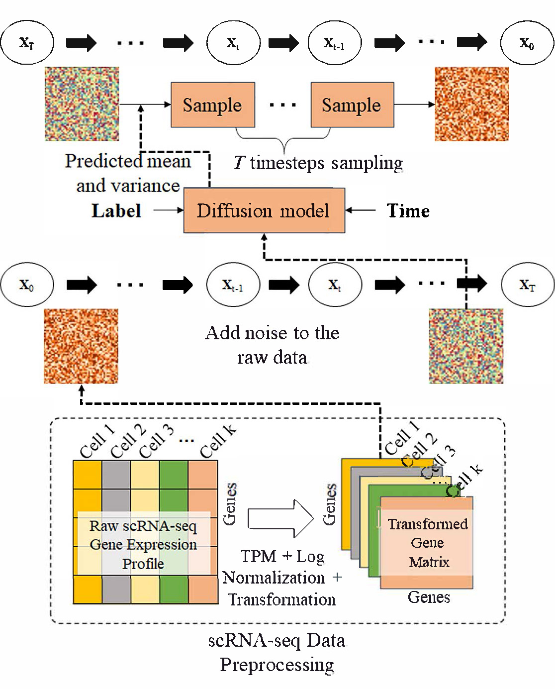

# GDSim: Accurate simulation for Single-Cell Transcriptomes with Multiple Deep Generative Adversarial Networks
The emergence of single-cell transcriptome sequencing has revealed cellular heterogeneity and allows for the analysis of cellular developmental processes at the individual cell level. Despite its significant potential, challenges such as technical limitations, high costs, and the scarcity of certain samples result in some scRNA-seq data being insufficient. Consequently, when utilizing downstream analysis software to address such issues, there is a lack of sufficient baseline data or an inadequate number of training samples for training large biological models. This study introduces an innovative deep generative network named GDSim for the simulation generation of scRNA-seq data. GDSim is based on a diffusion model that enables the exploration of deep gene expression dependencies within scRNA-seq data, aiming to generate simulated data that closely aligns with the distribution of the original data. Experimental results demonstrate that GDSim exhibits high accuracy in recovering data distribution characteristics, surpassing currently state-of-the-art methods. Additionally, it demonstrates a high level of consistency with the original data in terms of cell subtype clustering and gene differential expression analysis.
## 描述
The input to scMultiGAN is a pre-processed count single cell matrix, with columns representing genes and rows representing cells. It's output is an imputed count matrix with the same dimension. The complete pipeline and the datasets used in the paper is described with the following image.

## Environment Requirement
1. `R version > 3.5`
* argparse  
2. `Python 3.7`
* Pytorch > 1.0
* Numpy  1.18
* Pandas 1.3.5
* Pathlib
* torchvision 0.13.0
## Dataset
We used a demo dataset that contains the no-imputed data and the corresponding cell label files. For more details, please see the `data`
## GDSim parameters:
1. `train.py`
```bash
--timesteps            #int, The max steps used to add noise to the raw data
--gene_expression_file #str, The gene expression matrix used to train the difussion model and simulate the expression data
--use_label            #bool, Select if use the pre-defined label or not, default is False
--use_time_emb         #bool, If encode the time and add it to the data, default is True
--label_file           #str, If use the label, pleas provide the label data
--data_type            #str, Input data is raw or normalized
--batch_size           #int, The batch size used to train the model
--model_channels       #int, The model channels used in the model
--epochs               #int, The epochs used to train the model
--lr                   #int, The learning rate used to train the model
--change_threshold     #int, The threshold of loss variation when training stops
--loss_threshold       #int, The threshold of loss when training stops
--use_gene             #int, The numbers of gene used to train and simulate (The genes are top of the highest variance in expression level), the number of genes must be a square of an integer
--num_res_blocks       #int, the number of resblocks
--dim_mults            #int, The depth of the UNet, here is should be noted that the number of genes used must be an interger multiple of depth minus one
--save_models          #str, The path to save the model
--checkpoint           #str, If use the pre-trained model
--out_dir              #str, The path to save the simulated gene expression matrix
```
2. `sample.py`
```bash
--checkpoints          #int
--batch-size           #int
--output               #str, The path of the simulation files
--ncls                 #int, The number of cell types
--img_size             #int, The square root of the simulated number of genes
--label_file           #str, The path of the cell label files
```
## An example to run GDSim
1. Training process
* `Python train.py --gene_expression_file "data/raw.csv" --use_label True --label_file "data/label.txt" --data_type "raw" --batch_size 24 --epochs 200 --lr 1e-4 --change_threshold 0.001 --loss_threshold 0.05 --use_gene 16384 --save_models "model_path" --out_dir "output_path" --checkpoint "checkpoint_path"`
* &emsp;
When training does not start from scratch, the 'checkpoint' parameter is used.
2. Sampling process
* `Python sample.py --checkpoints "selected_trained_models_path" --output "output/out.csv" --label_file "data/label.txt" --ncls 6 --img_size 128`
